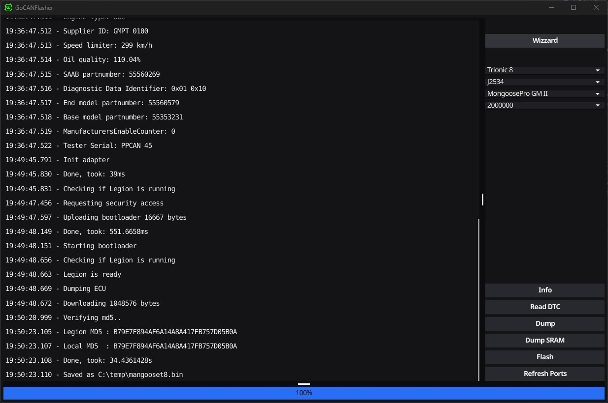

# goCANFlasher

Trionic 5/7/8 ecu flasher

## Starting

### Windows 

    $env:PKG_CONFIG_PATH="C:\vcpkg\packages\libusb_x86-windows\lib\pkgconfig"; $env:CGO_CFLAGS="-IC:\vcpkg\packages\libusb_x86-windows\include\libusb-1.0"; $env:CGO_ENABLED=1; $env:GOOS="windows"; $env:GOARCH="386"; go run -tags combi .

### Linux

    CGO_ENABLED=1 GOOS=linux go run .

## Todo

Add support for Trionic 8 (T8) flashing. Only dumping is currently available for this ECU.